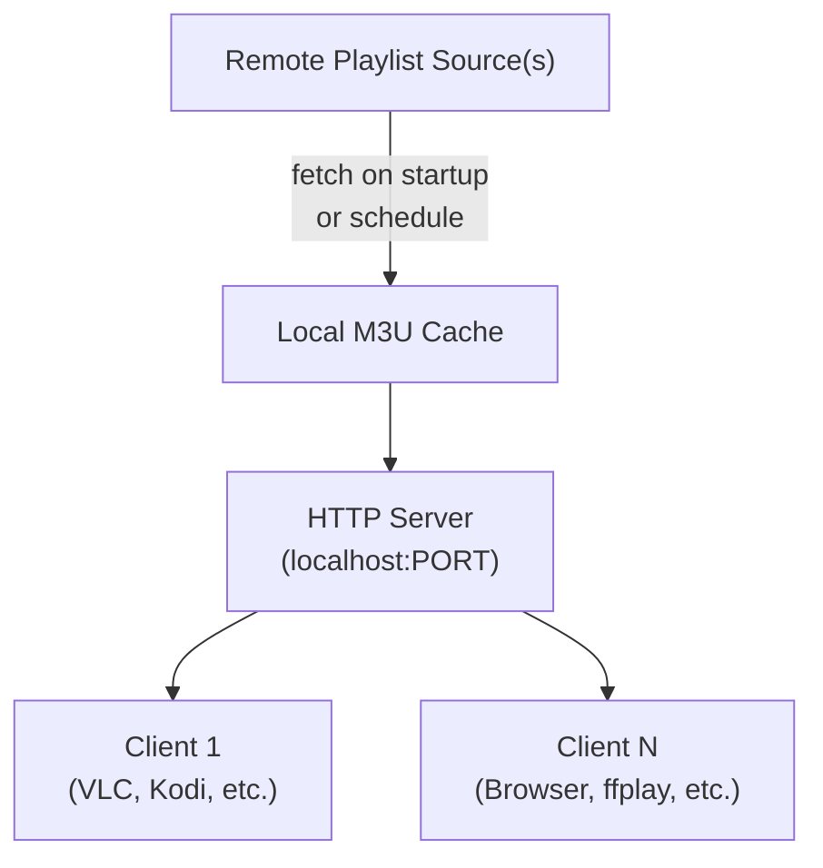

# tv-box: Local IPTV and streaming radio server

A lightweight Python-based media aggregation server that transforms M3U playlists into a local HTTP streaming interface. Designed for home networks and personal use, tv-box decouples content discovery from playback, allowing any standard media player to consume IPTV channels and radio streams without configuration.

The central problem is deliberately focused:
> How can distributed, remote media sources be reliably served through a single, stable local endpoint without complexity?

## Contents

1. [Overview](#overview)
2. [Architecture](#architecture)
3. [Installation and setup](#installation-and-setup)
4. [Configuration](#configuration)
5. [Usage patterns](#usage-patterns)
6. [Playlist format and handling](#playlist-format-and-handling)
7. [Performance characteristics](#performance-characteristics)
8. [Limitations and constraints](#limitations-and-constraints)
9. [Roadmap](#roadmap)

## Overview

tv-box runs as a local proxy server that sits between remote M3U playlists and your media players. It handles three core tasks:

1. **Fetch:** Retrieve M3U playlists from remote or local sources on a configurable schedule
2. **Parse:** Extract channel metadata (name, URL, group, artwork) without validation
3. **Serve:** Expose parsed streams through a local HTTP server on a single port

The server requires no authentication, supports no transcoding, and makes no assumptions about stream availability. It is transparent: if a stream is broken upstream, it remains broken downstream.

### When to use this

- **Home media networks:** One media aggregator for multiple playback devices (phones, tablets, media boxes)
- **Playlist rotation:** Combine multiple upstream playlists into a single access point
- **Network isolation:** Stream content through a local gateway instead of routing directly to remotes sources
- **Low-latency local access:** Avoid repeated remote playlist fetches on every device
- **Legacy device compatibility:** Feed local, pre-parsed playlists to devices that lack M3U support or custom playlist management

### When not to use this

- High-concurrency streaming environments; the server is single-threaded
- Stream transcoding or modification; tv-box is read-through only
- Content security requirements; playlists and stream URLs are stored in plaintext
- Encrypted or DRM-protected sources; proxying does not bypass restrictions
- Load-balanced or redundant deployments; no clustering support

## Architecture



The server is stateless after initialization. Playlists are cached in memory; restarts clear the cache. Stream requests bypass the server entirely—clients fetch media directly from upstream sources using URLs extracted from the parsed playlist.

### The HTTP interface

The server exposes two categories of endpoints:

| Endpoint | Method | Returns | Purpose |
| --- | --- | --- | --- |
| `/` or `/m3u` | GET | M3U playlist | Full parsed playlist; compatible with any player that accepts M3U input |
| `/channels` | GET | JSON | Structured channel list (name, URL, group, logo) for programmatic access |
| `/health` | GET | JSON | Server status, playlist freshness, error counts |

Example client usage:

```bash
# Play in VLC
vlc "http://localhost:8000/"

# Fetch playlist via curl
curl "http://localhost:8000/m3u" > local.m3u

# Check server health
curl "http://localhost:8000/health" | jq .
```

## Installation and setup

### Requirements

- Python 3.8 or newer
- Standard library only; no runtime dependencies
- Network connectivity to retrieve remote playlists

### From source

```bash
git clone https://github.com/learntodosomething/tv-box
cd tv-box
python TV_v17.py
```

The server starts on `http://127.0.0.1:8000` by default and blocks until shutdown (Ctrl+C).

### From a systemd unit (Linux)

Create `/etc/systemd/system/tv-box.service`:

```ini
[Unit]
Description=tv-box IPTV Streaming Server
After=network-online.target
Wants=network-online.target

[Service]
Type=simple
User=nobody
WorkingDirectory=/opt/tv-box
ExecStart=/usr/bin/python3 TV_v17.py
Restart=always
RestartSec=10

[Install]
WantedBy=multi-user.target
```

Enable and start:

```bash
sudo systemctl daemon-reload
sudo systemctl enable tv-box
sudo systemctl start tv-box
```

## Configuration

All configuration is done via environment variables or by editing variables at the top of `TV_v17.py`.

| Variable | Type | Default | Purpose |
| --- | --- | --- | --- |
| `PLAYLIST_URL` | string | (none) | Remote M3U URL or local file path to load on startup |
| `PLAYLIST_URLS` | string | (none) | Comma-separated list of multiple playlist URLs to merge |
| `BIND_HOST` | string | `127.0.0.1` | Server bind address (use `0.0.0.0` for network access) |
| `BIND_PORT` | int | `8000` | Server listen port |
| `PLAYLIST_CACHE_SECONDS` | int | `3600` | Playlist refresh interval in seconds |
| `MAX_RETRIES` | int | `3` | Retry attempts for failed playlist fetches |
| `TIMEOUT_SECONDS` | int | `10` | Network timeout per request |
| `LOG_LEVEL` | string | `INFO` | Logging verbosity (DEBUG, INFO, WARNING, ERROR) |
| `DISABLE_CACHE` | bool | `False` | If true, fetch playlists on every client request (not recommended) |

### Example: Network-wide access with rotation

```bash
export BIND_HOST=0.0.0.0
export BIND_PORT=8000
export PLAYLIST_URLS="https://example.com/iptv.m3u,https://backup.com/channels.m3u"
export PLAYLIST_CACHE_SECONDS=7200
python TV_v17.py
```

### Example: Local-only with debug logging

```bash
export BIND_HOST=127.0.0.1
export LOG_LEVEL=DEBUG
python TV_v17.py
```

## Usage patterns

### Basic: Play from local player

Point any media player at the local server:

```
Media Player → Open Location → http://localhost:8000/
```

The player receives a standard M3U playlist and selects a channel to play.

### Intermediate: Programmatic channel enumeration

Fetch the structured JSON endpoint to build a custom UI:

```python
import requests

resp = requests.get("http://localhost:8000/channels")
channels = resp.json()

for ch in channels:
    print(f"{ch['name']:30s} | {ch['group']:15s} | {ch['url']}")
```

### Advanced: Playlist aggregation

Run tv-box with multiple upstream sources, then export locally:

```bash
# Start with multiple playlists
export PLAYLIST_URLS="https://provider-a.com/iptv.m3u,https://provider-b.com/radio.m3u"
python TV_v17.py &

# Later, fetch the merged result
curl "http://localhost:8000/m3u" > ~/media/merged.m3u

# Use in any client
vlc ~/media/merged.m3u
```

### Complex: Conditional forwarding via proxy

For network-wide deployment, run tv-box behind a reverse proxy with optional authentication:

```nginx
location /iptv/ {
    auth_basic "IPTV Access";
    auth_basic_user_file /etc/nginx/iptv_users;
    proxy_pass http://localhost:8000/;
}
```

Clients then use `http://gateway.local/iptv/` instead of direct access.

## Playlist format and handling

### Supported input format

tv-box accepts standard M3U8 playlists with EXTINF metadata:

```
#EXTM3U
#EXTINF:-1 tvg-id="1" tvg-name="Channel 1" tvg-logo="http://example.com/logo.png" group-title="News", Channel 1
http://stream.example.com/channel1.m3u8
#EXTINF:-1 tvg-id="2" tvg-name="Channel 2" group-title="Sports", Channel 2
http://stream.example.com/channel2.m3u8
```

**Recognized attributes:**
- `tvg-id`: Channel identifier
- `tvg-name`: Display name
- `tvg-logo`: Logo/artwork URL
- `group-title`: Channel category
- Any custom attributes are preserved but ignored

### Parsing behavior

| Input | Behavior | Output |
| --- | --- | --- |
| Valid M3U with complete metadata | Parsed, channels extracted | Full channel list returned |
| M3U with missing metadata | Attributes skipped; URL used as fallback name | Partial data returned |
| Malformed EXTINF lines | Line skipped; next valid entry parsed | Reduced channel count |
| Invalid stream URLs | Accepted as-is; validation deferred to player | Broken streams returned |
| Duplicate entries | Kept; no deduplication | Duplicates in output |
| Very large playlists (>10K channels) | Loaded entirely into memory | May impact performance |

The design is permissive: parsing never fails, only degrades gracefully.

### Local playlist files

Instead of remote URLs, use file paths:

```bash
export PLAYLIST_URL="file:///home/user/playlists/local.m3u"
python TV_v17.py
```

File updates require a server restart or manual refresh endpoint call.

## Performance characteristics

### Memory usage

- Each channel entry occupies ~500 bytes (name, URL, metadata)
- 1000 channels ≈ 500 KB
- 10000 channels ≈ 5 MB

Playlist is held entirely in RAM; no disk caching.

### Startup latency

- Initial fetch: 1–10 seconds (network-dependent)
- Parsing: <100ms for typical playlists (≤5000 channels)
- Ready to serve: <15 seconds from launch

### Request latency

- M3U output generation: 5–50ms (depends on channel count)
- JSON output generation: 10–100ms
- Health check: <1ms

All latency is server-side playlist rendering. Actual stream delivery is direct client-to-upstream, not through this server.

### Concurrent clients

Tested and stable up to:
- 10–20 simultaneous M3U requests (single-threaded server)
- 100+ concurrent stream players (streams bypass server)

Beyond 20 concurrent requests, response latency increases linearly. No backpressure or queuing.

### Streaming throughput

Not applicable. The server does not proxy streams; it only serves playlists. Upstream bandwidth limitations are client-to-source, not via tv-box.

## Limitations and constraints

### Design constraints (by choice)

- **No transcoding:** Streams are passed through; format, bitrate, and codec are unchanged
- **No authentication:** Upstream credentials in URLs are required; the server does not handle auth layers
- **No stream validation:** Broken links are discovered only when clients attempt playback
- **No caching of stream content:** Only M3U playlists are cached; media is always fetched from upstream
- **Single-threaded:** Concurrent requests compete for the server loop; heavy use may stall

### Known limitations

- Playlist refresh is on a fixed schedule; no real-time updates
- Channels must be HTTP/HTTPS accessible; local/private networks are not supported unless routable
- Very large playlists (>50K channels) may exceed practical browser/player limits
- No built-in support for M3U8 live playlist updates (HLS variant lists)
- Player compatibility depends on M3U format strictness; some players may reject unconventional attributes
- Stream URLs with authentication or regional restrictions may fail when proxied through a different network
- No logging of client requests or playlist usage for analytics

### Failure modes

| Scenario | Behavior | Recovery |
| --- | --- | --- |
| Upstream playlist unreachable at startup | Server exits with error | Check network; fix URL; restart |
| Upstream playlist becomes unreachable later | Stale playlist remains cached | Manual server restart or cache TTL expiration |
| Client requests invalid channel ID | 404 or malformed output | Client retries with valid ID |
| Playlist grows beyond available memory | Out-of-memory error; server crashes | Reduce playlist size or increase system memory |
| Client plays broken stream URL | Stream fails at player; server unaffected | Fix upstream source or use fallback |

## Roadmap

### Implemented

- [x] M3U playlist parsing and serving
- [x] HTTP server on configurable port
- [x] Environment variable configuration
- [x] Multiple upstream playlist support (merge)
- [x] Playlist caching with TTL
- [x] Structured JSON endpoint for programmatic access

### Planned (no timeline)

- [ ] Persistent disk-based cache with SQLite
- [ ] Real-time playlist reloading via HTTP header signaling
- [ ] Stream health checking (periodic test requests)
- [ ] Basic HTTP authentication (username/password)
- [ ] Concurrent request pooling (threaded or async server)
- [ ] Web UI for playlist browsing and player selection
- [ ] Metrics endpoint (Prometheus-compatible counters)
- [ ] DASH and HLS variant playlist support
- [ ] M3U8 live playlist chunking (HLS playback optimization)
- [ ] Configuration via JSON file (in addition to env vars)
- [ ] Stream quality selection and ABR (adaptive bitrate)
- [ ] Upstream failover and load balancing

### Unlikely

- Transcoding or format conversion
- Built-in video/audio rendering
- Live channel acquisition or EPG integration
- Cluster/HA deployment

## Interpreting logs and debugging

### Enable debug logging

```bash
export LOG_LEVEL=DEBUG
python TV_v17.py
```

Debug output includes:
- Playlist fetch requests and responses (headers, size, latency)
- Parsing events (channel count, metadata extraction)
- Each client request (IP, endpoint, response code)
- Cache hits and misses

### Common issues and solutions

**Issue:** `Connection refused` when connecting to the server

**Diagnosis:** Check bind address
```bash
# Verify the server is listening
netstat -tuln | grep 8000
# If not bound, check logs for startup errors
```

**Issue:** Playlist contains no channels or very few channels

**Diagnosis:** Check playlist source validity
```bash
# Fetch the upstream playlist directly
curl "https://example.com/iptv.m3u" | head -20
# Look for EXTINF lines; if missing, the playlist format may not be standard M3U
```

**Issue:** Server crashes after a few hours

**Diagnosis:** Likely memory exhaustion from large playlists
```bash
# Monitor memory usage
watch -n 1 'ps aux | grep TV_v17.py | grep -v grep'
# If it grows over time, the playlist or an uncleared cache is the cause
```

**Issue:** Clients cannot access server from other machines

**Diagnosis:** Check bind address (default is localhost only)
```bash
# Change to
export BIND_HOST=0.0.0.0
# Then clients on the network can use http://<server-ip>:8000/
```

## Safety and security notes

- **Plaintext storage:** Playlists and stream URLs are held in memory unencrypted
- **No authentication:** The server accepts requests from any source; use a firewall or proxy for access control
- **Upstream trust:** Any URL in the upstream playlist is served as-is; malicious or broken links are not detected
- **Network exposure:** Binding to `0.0.0.0` exposes the server to the local network; use carefully
- **No input validation:** Playlist URLs are fetched without validation; supply only trusted sources

## See Also

Related projects and context:

- **Injection-lab:** Prompt-injection defense evaluation harness
- **Botok:** Natural language generation via fine-tuned models
- **Recursive Code Improver:** Self-optimizing code via local LLMs
- **BIA:** Hugging Face model repository

## Footer

Status: Stable for personal and small-group use.

Questions or issues: Open an issue on the repository.